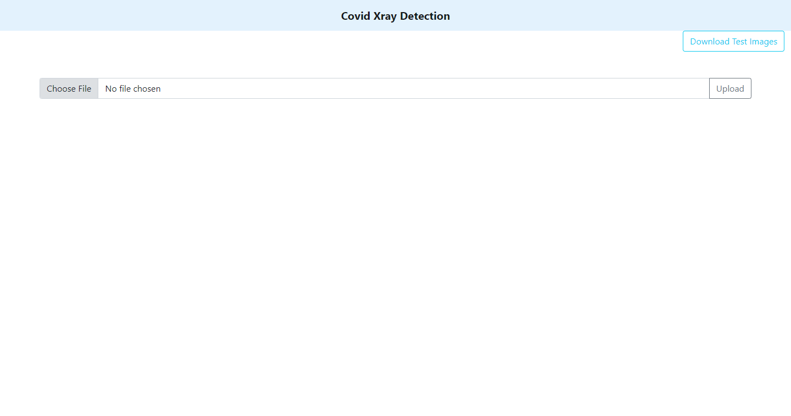

# Xray-Covid-Detection

Aim of this project is to detect Covid in patients using their X-Rays. \
Classification Model: **Resnet18**\
Deep Learning Framework: **Pytorch**\
API Framework: **Flask**

<br>

## Screenshots



<br>

## Features

- Responsive Web App
- Supports Every Operating System
- Can be easily deployed
- Easy to use architecture
<br>

## Tech Stack

**Client:** HTML, CSS and Bootstrap

**Server:** Python

<br>
  
## API Reference

### Train the Model

```http
  POST /train (type=json)
```

| Parameter | Type     | Description                |
| :-------- | :------- | :------------------------- |
| `batch_size` | `int` |batch size  |
| `epochs` | `int` |Number of epochs to train |
| `num_workers` | `int` |Number of workers  |
| `learning_rate` | `int` |learning rate  |
| `momentum` | `int` |momentum  |
| `dataset_path` | `path/string` |Path where the data is stored  |
| `model_save_folder` | `path/string` |Folder/Directory name to store model  |

### Prediction

```http
  POST /predict
```

| Parameter | Type     | Description                       |
| :-------- | :------- | :-------------------------------- |
| `image_path`      | `path/string` | **Required**. Path of the image |
<br>

## Installation

Install dependencies for the project using _**pip**_

```bash
    cd <project-folder>
    pip install requirements.txt
```
<br>

## Deployment

Project can be deployled on Heroku

```bash
  git add .
  git commit -m <message>
  git push heroku main
```
Refer to the official documentation for more details: https://devcenter.heroku.com/articles/getting-started-with-python

<br>

## License

[MIT](https://choosealicense.com/licenses/mit/)

  
## Author

[@Rishabh1501](https://github.com/Rishabh1501)

  
## Support

For support, email at rishabhkalra1501@gmail.com .

  
